# ☀️ HeliosNet-XAI

## Explainable Hybrid Deep Learning and Ensemble Learning Framework for Solar Storm Forecasting

<p align="center">


</p>

---

# 🌌 Overview

**HeliosNet-XAI** is a hybrid Artificial Intelligence framework developed for **solar storm forecasting and space weather prediction** using a combination of:

* Deep Learning
* Ensemble Learning
* Explainable Artificial Intelligence (XAI)
* Statistical Feature Engineering
* Hyperparameter Optimization

The framework integrates advanced sequential neural networks with gradient boosting models to improve forecasting accuracy while maintaining interpretability through SHAP-based explanations.

The project is designed to support:

* Solar flare prediction
* Geomagnetic storm forecasting
* Space weather monitoring
* Satellite risk assessment
* Power grid protection research
* Explainable scientific AI systems

---

# 🎯 Key Features

### Hybrid Deep Learning

* Long Short-Term Memory (LSTM)
* Advanced GPU-Optimized GRU
* Sequential Time-Series Modeling

### Ensemble Learning

* XGBoost
* CatBoost
* Hybrid Ensemble Framework

### Explainable AI

* SHAP Summary Analysis
* SHAP Feature Importance
* Global Model Interpretability

### Optimization

* Optuna Hyperparameter Optimization
* K-Fold Cross Validation
* Automated Feature Selection

### Space Weather Analytics

* Solar Activity Forecasting
* Solar Wind Analysis
* CME Impact Prediction
* Geomagnetic Index Modeling

---

# 🏗 HeliosNet-XAI Architecture

```text
Solar Observations
        │
        ▼
Data Collection
(GOES • OMNI • CME • KP)
        │
        ▼
Preprocessing
        │
        ▼
Feature Engineering
        │
        ▼
Feature Selection
        │
        ▼
 ┌─────────────────────┐
 │    LSTM Network     │
 └─────────────────────┘
        │
 ┌─────────────────────┐
 │ Advanced GPU GRU    │
 └─────────────────────┘
        │
 ┌─────────────────────┐
 │      XGBoost        │
 └─────────────────────┘
        │
 ┌─────────────────────┐
 │      CatBoost       │
 └─────────────────────┘
        │
        ▼
 Ensemble Learning
        │
        ▼
 Solar Storm Forecast
        │
        ▼
 SHAP Explainability
```

---

# 📂 Project Structure

```text
HeliosNet-XAI/

├── src/
│   ├── preprocessing.py
│   ├── feature_engineering.py
│   ├── feature_selection.py
│   ├── lstm_model.py
│   ├── xgboost_model.py
│   ├── catboost_model.py
│   ├── ensemble.py
│   ├── shap_analysis.py
│   ├── optuna_xgboost.py
│   ├── evaluation.py
│   └── data_loader.py
│
├── models/
│   ├── advanced_gpu_gru_model.keras
│   ├── advanced_lstm_model.keras
│   ├── lstm_model.keras
│   ├── xgboost_model.pkl
│   └── catboost_model.cbm
│
├── outputs/
│   └── plots/
│
├── requirements.txt
└── README.md
```

---

# 📊 Datasets

The framework is designed to integrate multiple space-weather data sources:

### GOES X-Ray Flux

* Solar flare monitoring
* X-ray intensity measurements

### OMNI Solar Wind Dataset

* Solar wind speed
* Plasma density
* Interplanetary magnetic field

### LASCO CME Dataset

* Coronal Mass Ejection observations
* CME propagation analysis

### Kp Geomagnetic Index

* Geomagnetic disturbance measurement
* Storm intensity evaluation

### SHARP Solar Data

* Active region characteristics
* Magnetic field analysis

---

# 🔬 Explainable AI (XAI)

HeliosNet-XAI emphasizes interpretability through SHAP-based model explanations.

### SHAP Summary Plot

<p align="center">
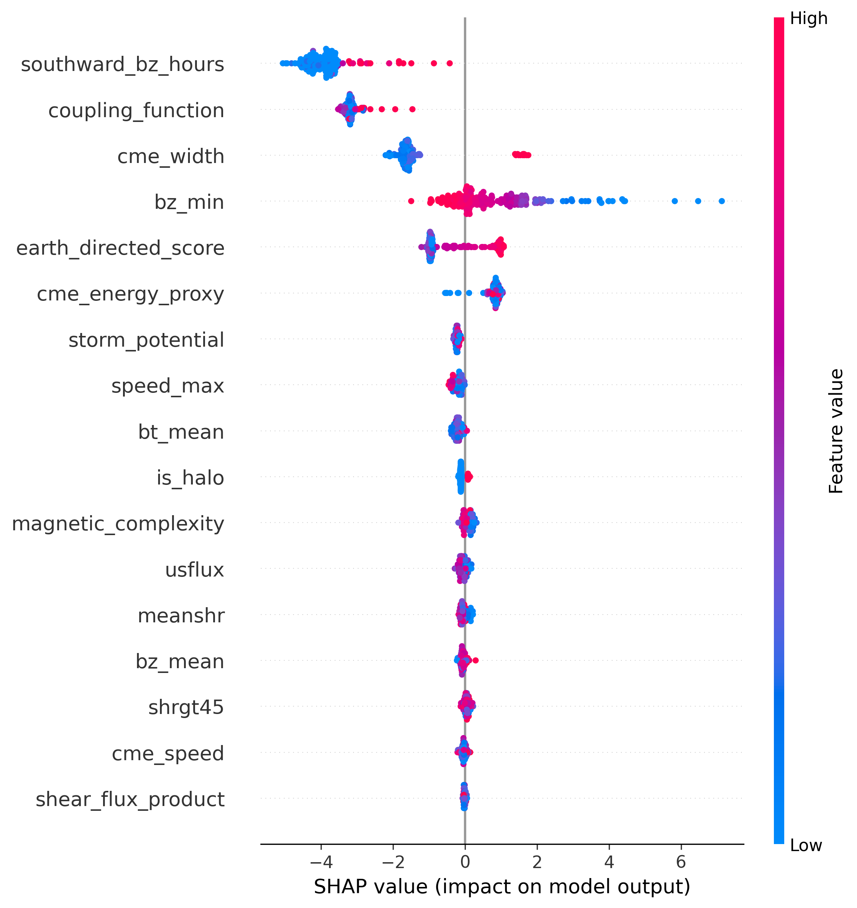
</p>

---

### SHAP Feature Importance

<p align="center">
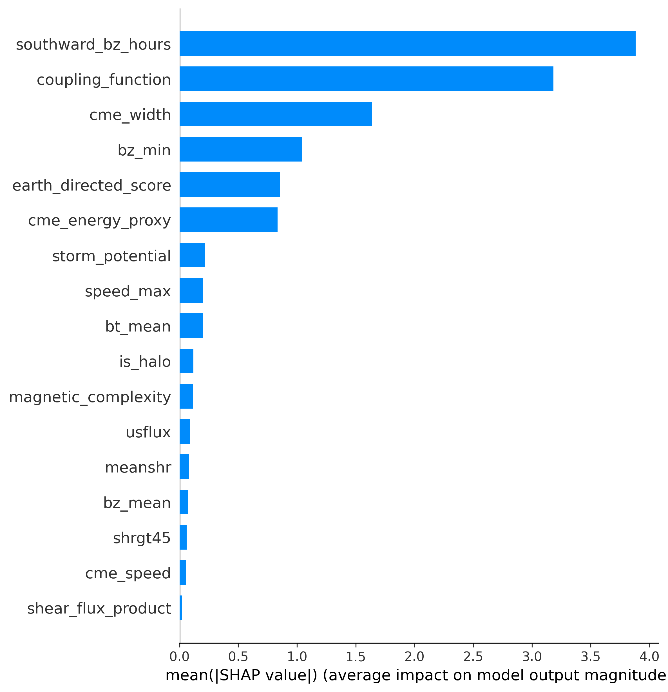
</p>

---

# 📈 Model Performance

## ROC Curve

<p align="center">
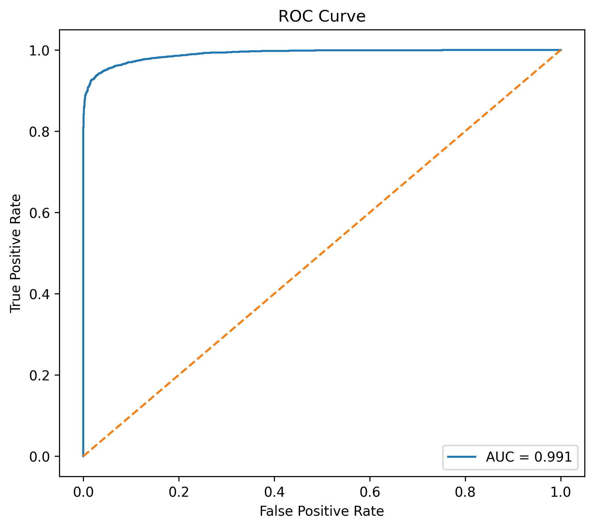
</p>

---

## CatBoost ROC Curve

<p align="center">
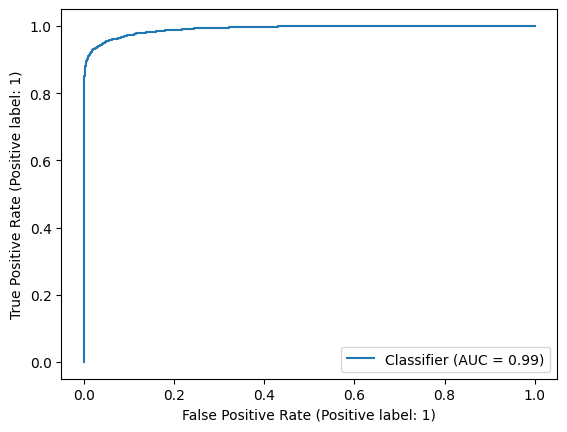
</p>

---

## Ensemble ROC Curve

<p align="center">
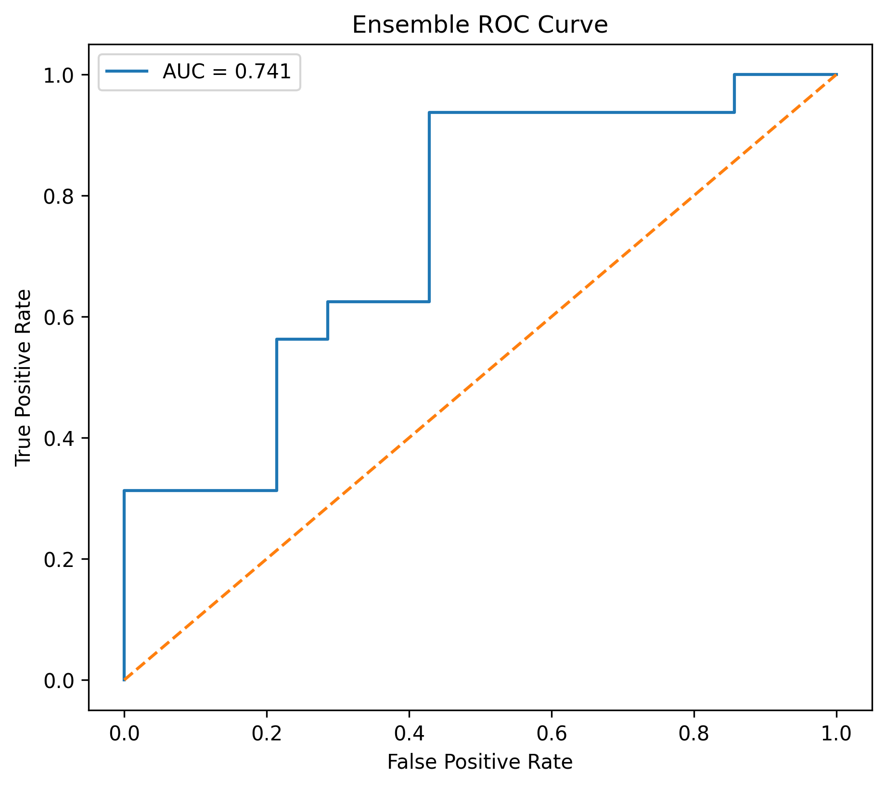
</p>

---

# 🎯 Confusion Matrix Analysis

## Deep Learning Model

<p align="center">
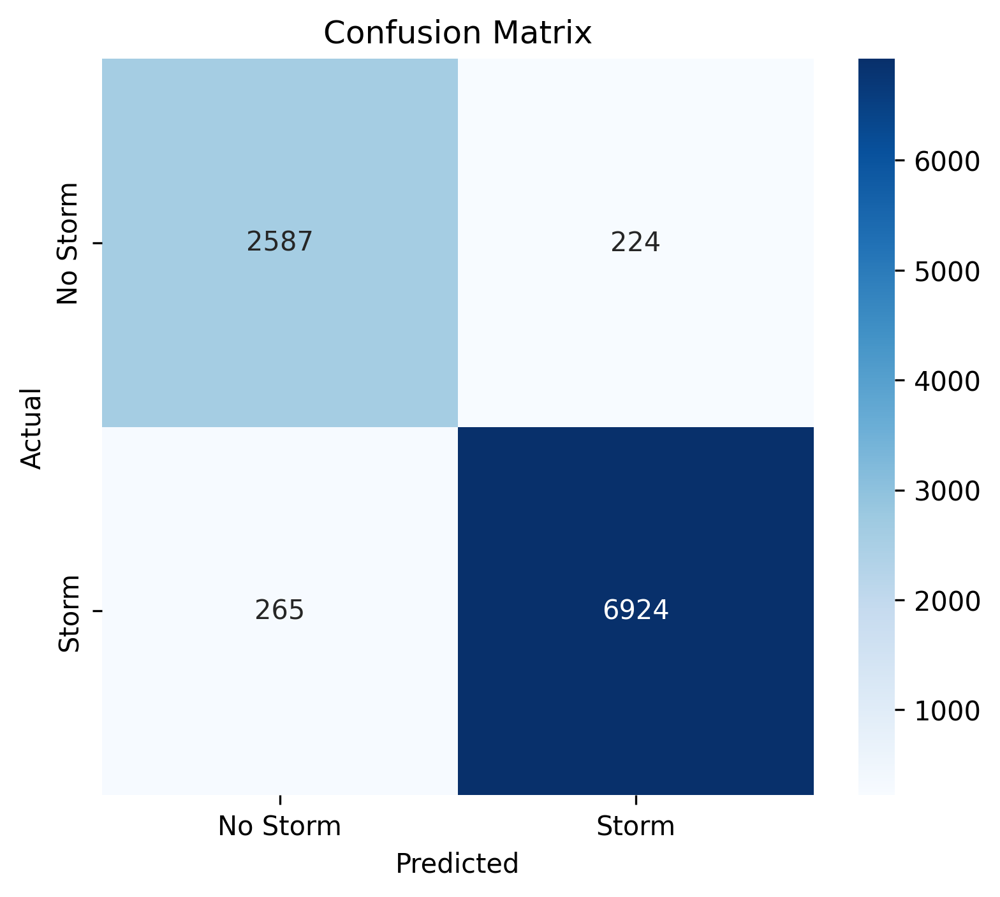
</p>

---

## CatBoost Model

<p align="center">
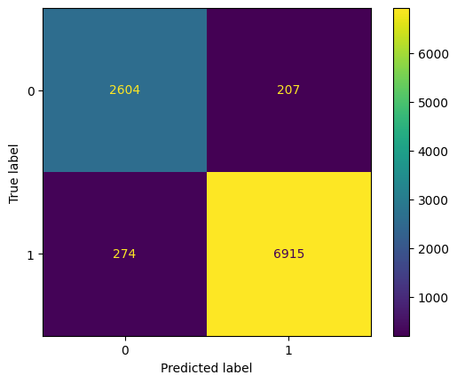
</p>

---

## Ensemble Model

<p align="center">
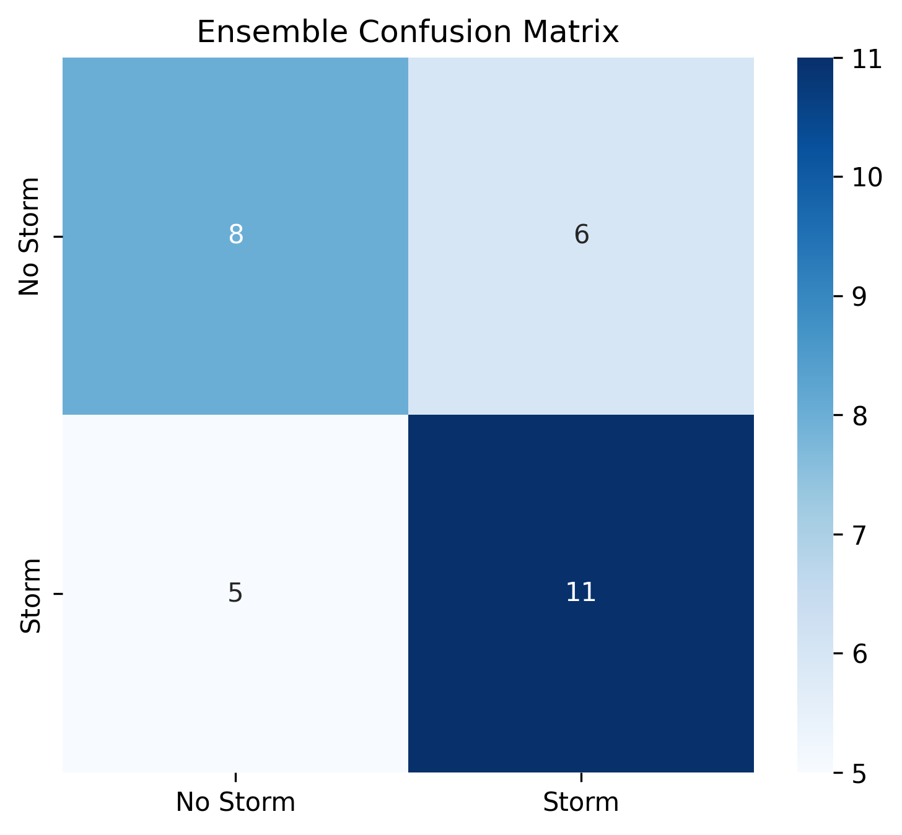
</p>

---

# 🧠 Feature Analysis

## Feature Correlation Matrix

<p align="center">
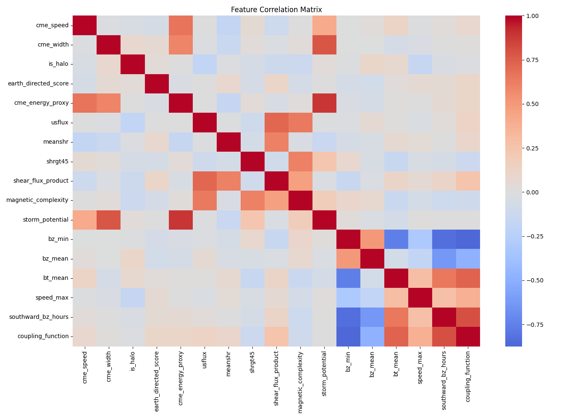
</p>

---

## Feature Importance

<p align="center">
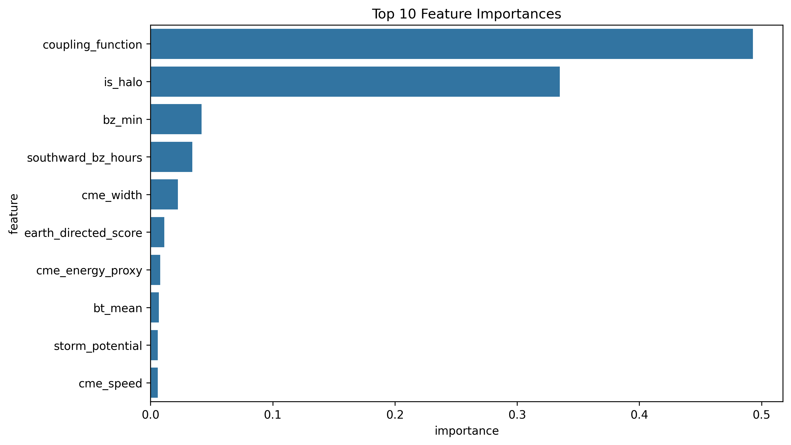
</p>

---

## CatBoost Feature Importance

<p align="center">
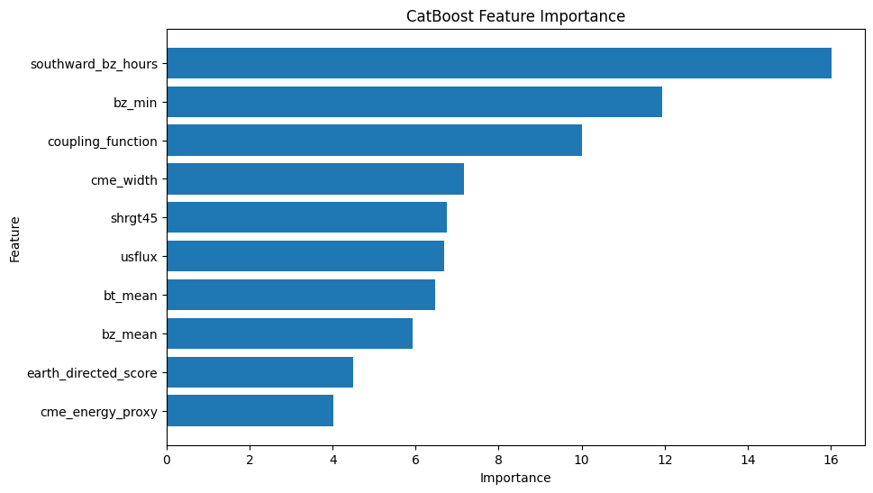
</p>

---

# 🚀 Training Dynamics

## Advanced GPU GRU Training Curve

<p align="center">
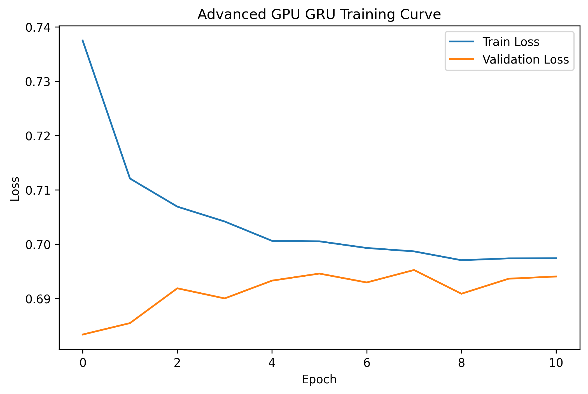
</p>

---

# ⚙️ Methodology

### Phase 1: Data Collection

* GOES X-Ray
* OMNI Solar Wind
* LASCO CME
* Kp Index
* SHARP Active Region Data

### Phase 2: Data Engineering

* Cleaning
* Normalization
* Balancing
* Feature Construction

### Phase 3: Feature Optimization

* Correlation Analysis
* Feature Selection
* Dimensionality Reduction

### Phase 4: Model Training

* LSTM
* Advanced GRU
* XGBoost
* CatBoost

### Phase 5: Ensemble Learning

Prediction fusion across multiple models to maximize forecasting performance.

### Phase 6: Explainability

SHAP analysis to identify influential space-weather variables.

---

# 🛰 Applications

### Space Weather Monitoring

* Solar flare forecasting
* CME prediction
* Geomagnetic storm forecasting

### Aerospace

* Satellite protection
* Mission planning
* Communication reliability

### Power Systems

* Grid stability forecasting
* Infrastructure protection

### Scientific Research

* Solar activity analysis
* Space weather modeling
* Explainable AI research

---

# 📚 Research Contributions

* Hybrid Deep Learning for Solar Storm Forecasting
* Ensemble Learning Framework for Space Weather Prediction
* Explainable AI using SHAP
* GRU-LSTM-XGBoost-CatBoost Integration
* Optuna-Based Hyperparameter Optimization
* Interpretable Scientific Machine Learning

---

# 🔮 Future Work

* Transformer-based Space Weather Models
* Temporal Fusion Transformers
* Vision Transformers for Solar Imagery
* Physics-Informed Neural Networks
* Real-Time Forecast Deployment
* Multimodal Solar Observation Integration
* Foundation Models for Space Weather

---

# 👨‍💻 Author

**Manikandan**

Artificial Intelligence & Data Science

Research Areas:

* Space Weather Analytics
* Explainable Artificial Intelligence
* Deep Learning
* Time-Series Forecasting
* Ensemble Learning
* Scientific Machine Learning

---

# 📜 License

MIT License

---

# 📖 Citation

```bibtex
@software{HeliosNetXAI2026,
  author = {Manikandan},
  title = {HeliosNet-XAI: Explainable Hybrid Deep Learning and Ensemble Learning for Solar Storm Forecasting},
  year = {2026},
  publisher = {GitHub}
}
```

---

# ⭐ Support

If you find this project useful for research, space weather forecasting, explainable AI, or scientific machine learning, please consider starring the repository.
